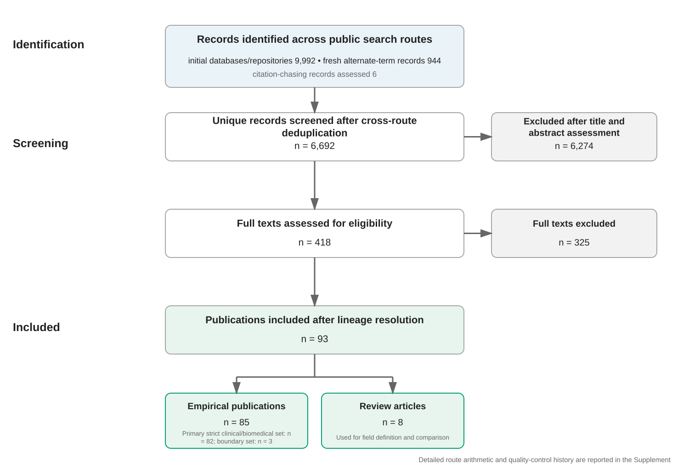
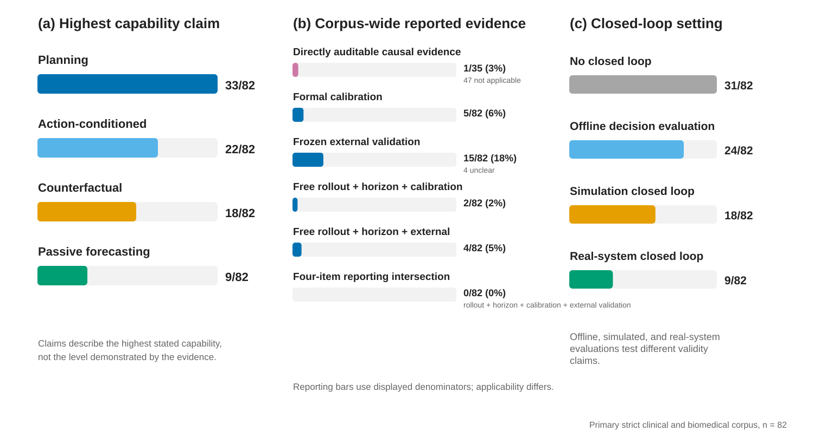
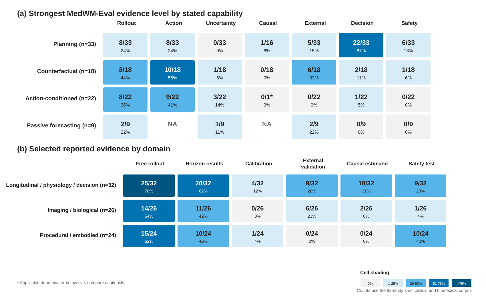

# Capability-Matched Evaluation of Medical World Models: A Scoping Review of Rollout, Causal Validity, and Safety

**Article type:** Scoping review with methodological framework  
**Target journal:** Journal of Biomedical Informatics  
**Search cutoff:** 12 September 2026

## Abstract

**Objective:** Medical world models represent how a patient, biological system, image, procedure, or device state changes over time, sometimes under an intervention or control action. Their claims range from forecasting to counterfactual comparison and closed-loop planning, but the evidence needed to support each claim is not standardized. We mapped reported evaluation evidence and developed a preliminary capability-matched framework for interpreting it.

**Methods:** We searched PubMed, Europe PMC, OpenAlex, Crossref, and arXiv for records published from 2020 through 12 September 2026, with alternate-term retrieval and citation chasing. We assessed 6,692 unique titles and abstracts and 418 full texts. The lineage-resolved corpus contained 85 empirical studies and 8 reviews; 82 directly clinical or biomedical studies formed the primary analysis and three health-adjacent records were retained for sensitivity analysis. Primary texts were charted for state, action, horizon, rollout, uncertainty, causal assumptions, external validation, decision utility, safety, and reproducibility. Two separate AI-assisted coding passes applied the preliminary MedWM-Eval rubric, followed by source-grounded adjudication.

**Results:** In the 82-study primary set, highest claims were planning (33), action-conditioned simulation (22), counterfactual comparison (18), or passive forecasting (9). Free-running rollout appeared in 54 studies, horizon-resolved results in 41, formal calibration in 5, frozen external validation in 15, and explicit safety-hazard tests in 20. The corpus-wide four-feature reporting intersection was 0/82. In a post hoc probabilistic multistep sensitivity set (n=15), two studies reported calibration, three frozen external validation, and none both. Among 72 studies with an operational action, 30 used an action-agnostic comparator and 45 perturbed action; 12/35 studies with causal or policy-applicable claims stated an explicit causal estimand.

**Conclusion:** Direct state and dynamics evidence was more commonly reported than calibrated, horizon-resolved free-running evaluation, causal identification, frozen external validation, or explicit safety testing. The preliminary MedWM-Eval framework links four capability classes to proposed evidence considerations and identifies calibrated free-running rollout with frozen external validation as a tractable benchmark opportunity, not a universal checklist.

**Keywords:** medical world model; patient simulation; clinical trajectory; counterfactual prediction; calibration; artificial intelligence safety

## Statement of Significance

| Required item | Statement |
| --- | --- |
| Problem or issue | Medical world models make forecasting, counterfactual, and planning claims using heterogeneous tasks and evidence. |
| What is already known | Existing reviews organize architectures, application domains, capability levels, digital-twin design, and translation challenges. |
| What this review adds | A study-level capability-matched audit: an 82-study primary evidence map, a preliminary interpretation framework, and a joint reporting gap that motivates a real-data benchmark. |

## 1. Introduction

Clinical care is a dynamical process. Patient state changes between observations, measurements are acquired selectively, interventions alter later trajectories, and decisions depend on consequences that are not observable when an action is chosen. Medical world models address this structure by representing a state and learning how it evolves, either passively or under an explicit action.

Recent reviews define the field through capability ladders, patient simulators, clinical dynamics, digital twins, virtual cells, and translational requirements [1-8]. Together they establish that a medical world model is more than a static predictor or an unconstrained generator. It must represent a changing system and support some combination of future-state prediction, intervention-conditioned simulation, counterfactual comparison, or planning. The reviews also identify uncertainty, causal validity, safety, and clinical evaluation as recurring challenges.

A contemporaneous digital-twin perspective similarly argues that validation burden should follow the clinical claim rather than model architecture [100]. The present review therefore does not claim to originate that principle; its intended contribution is to operationalize it in a lineage-resolved, study-level empirical audit.

The empirical literature spans longitudinal health records, physiological signals, treatment-conditioned imaging, disease-progression simulators, cellular systems, neurophysiology, ultrasound guidance, surgical video, and robotic control [9-93]. These systems share a dynamic formulation but differ sharply in what their outputs mean. A future image can be evaluated for visual fidelity, a patient trajectory for calibration and event timing, and a robotic rollout for geometric and physical validity. A medication token records an observed care decision, whereas a robot command may be executed directly. The same metric therefore cannot support the same interpretation across all systems.

The central problem is a mismatch between capability claims and evaluation evidence. One-step prediction can establish local transition accuracy but not stability under repeated rollout. Conditioning on a treatment can establish responsiveness but not the outcome under an unobserved alternative treatment. High policy return can establish performance inside a simulator while leaving simulator mismatch and real-system safety unresolved. The evidentiary requirement grows as a model moves from forecasting toward intervention comparison and planning.

We conducted an evaluation-centred scoping review to answer three questions. First, what is the highest capability claimed by each empirical medical world model? Second, what evidence is reported for rollout, action dependence, uncertainty, causal validity, external validation, decision utility, safety, and reproducibility? Third, which missing evidence recurs across domains strongly enough to define a useful real-data benchmark? The primary outputs are a study-level evidence map, a preliminary capability-matched framework, and a review-derived benchmark agenda.

## 2. Methods

### 2.1 Review design and eligibility

The review followed PRISMA-ScR principles for scoping-review design and evidence charting, with search reporting informed by PRISMA-S [94,95]. The protocol was finalized on 12 September 2026 and was not prospectively registered. The 2020 lower boundary focuses the review on contemporary learned generative, digital-twin, and model-based-control systems; older patient simulators and disease models remain outside its historical scope.

An empirical study was eligible when it:

1. used medical, clinical, physiological, procedural, or biomedical data;
2. learned or adapted a temporal state transition, rollout mechanism, or action-conditioned generative process;
3. evaluated a future state, future observation, action response, counterfactual comparison, or planning capability; and
4. provided enough primary text to assess the method and evidence.

We excluded static predictors, ordinary image or text generators without temporal or action-conditioned dynamics, conceptual articles without empirical evaluation, and nonmedical world models used only as background. Reviews were retained in a separate comparison corpus when medical world models, patient simulators, biomedical digital twins, or virtual-cell world models were their primary topic. The primary synthesis required directly clinical, biomedical, physiological, or medical-procedural dynamics. Three health-adjacent boundary records were retained only in an extended sensitivity set.

Alternate terminology was common. Records without the phrase “world model” were eligible when the authors framed the system as a dynamic medical or biological twin, a patient or clinical-trial simulator, or a learned transition model used iteratively for model-based planning or closed-loop control. Conventional forecasting, disease-progression, pharmacometric, epidemiological, and latent-process models remained outside the corpus unless their stated function matched this dynamic simulator identity.

### 2.2 Information sources and search quality control

The public search covered PubMed, Europe PMC, OpenAlex, Crossref, and arXiv for records dated from 1 January 2020 through 12 September 2026. Query blocks combined explicit world-model terms with medical domains and dynamic capabilities such as trajectory, rollout, simulation, intervention, control, and planning. Alternate-term retrieval targeted digital twins, patient and clinical-trial simulators, biological dynamics, and model-based control. Backward and forward citation checks were conducted from included reviews and anchor empirical studies.

Across the integrated routes, 6,692 unique records received title and abstract decisions and 418 full texts were assessed. Three hundred twenty-five full texts were excluded, leaving 93 publications after publication-lineage resolution. The main flow is shown in Figure 1; route-specific retrieval, deduplication, screening, exclusion, and correction arithmetic are reported in the Supplement.

Search quality control identified that an early phrase-and-domain discovery filter missed eligible alternate terminology. Every record excluded by that filter was subsequently rescreened, a fresh alternate-term search was added, and the resulting eligibility decisions were frozen before final synthesis. The functional-identity rule was clarified during this quality-control phase, before final synthesis; six records were re-adjudicated after extraction and none entered the primary corpus. A dated deviation and correction table is provided in the Supplement.

The search did not directly query authenticated IEEE Xplore, ACM Digital Library, Scopus, or Web of Science. Publisher and proceedings pages were used for exact-title and publication-lineage checks where available. An authenticated engineering/citation-database update and information-specialist review remain required before journal submission.

### 2.3 Screening, lineage resolution, and extraction

Each route used two separate AI-assisted title and abstract assessments against the same frozen criteria. Records not excluded by both passes advanced conservatively to full text. Full-text decisions were also completed in separate review contexts, with disagreements adjudicated from the primary source. Inclusion quality control then rechecked whether each retained record learned a qualifying transition and evaluated a future, action, counterfactual, or planning capability.

Publication-lineage review compared titles, authors, identifiers, dates, preprint and journal relationships, corrections, withdrawals, and retractions. The final corpus contained 93 publications: 85 empirical studies and eight reviews. The 82-study primary clinical and biomedical corpus was used for quantitative synthesis; three health-adjacent records were used only to test boundary sensitivity.

The empirical studies were charted across 45 fields. The extraction covered data provenance, cohort scale, split strategy, observation process, missingness, censoring, state, decoder, action semantics and provenance, transition mechanism, horizon, rollout regime, baselines, state and transition metrics, calibration, causal interpretation, external validation, decision utility, safety, statistics, code, weights, data access, preprocessing, randomness, strengths, limitations, and source anchors. Each field contained a reported value, `NA` when not applicable, or `NI` when the inspected source did not identify the information.

### 2.4 MedWM-Eval coding

The preliminary MedWM-Eval framework codes evidence against the highest capability claimed in a study’s title, abstract, introduction, results, or conclusion:

- **Passive forecasting:** predicts a future state or observation under the observed process.
- **Action-conditioned simulation:** predicts a future conditional on a defined action.
- **Counterfactual comparison:** compares outcomes under alternative interventions or policies.
- **Planning:** selects sequential actions through model rollout or an explicit learned simulator.

When a study made several claims, one display category was assigned using the fixed order planning, counterfactual comparison, action-conditioned simulation, then passive forecasting. This ordering is descriptive rather than exclusive. Separate applicability tracks retained nonexclusive information: all studies entered the dynamics track; the action-input track required an operational action field; and the causal or policy track required the causal-estimand field to be applicable. Procedural control without a patient or biomedical intervention-outcome interpretation was marked causally not applicable.

Ten evidence domains were coded as absent, partial, or directly auditable: state, dynamics, rollout, action, uncertainty, causal validity, external validity, decision utility, safety, and reproducibility. Causal and action fields were marked not applicable when the highest claim did not require them. “Directly auditable” denotes the highest rubric level; it is not a certification of validity.

The coding also recorded free-running rollout, horizon-resolved results, formal calibration, frozen external validation, action-agnostic comparison, action perturbation, an explicit causal estimand, closed-loop setting, safety-hazard testing, and confirmed public code. Two separate AI-assisted passes completed 1,785 study-field decisions. Raw agreement was 88.0%. Capability-claim agreement was 88.2%, with Cohen’s kappa 0.835 and a study-bootstrap 95% interval of 0.732 to 0.931. Field-level kappa ranged from 0.598 for action evidence to 0.946 for public-code status. Source-grounded adjudication resolved 214 disagreements across 71 studies.

These estimates describe reproducibility between two AI-assisted coding passes. They do not establish human inter-rater reliability or construct validity. Qualified human verification of inclusions, exclusions, extracted fields, adjudications, and material claims remains a submission requirement.

### 2.5 Synthesis

Tasks and outcomes were too heterogeneous for meta-analysis. We therefore reported counts and proportions, retained unclear values, and did not calculate an aggregate quality score. Denominators were distinguished as: total corpus; applicable, excluding only `NA`; and known, additionally excluding `NI` and `unclear`. Studies were grouped by highest capability and by three primary domain classes: longitudinal/physiology/decision, imaging/biological, and procedural/embodied.

Sensitivity analyses compared the 82-study primary corpus with an 85-study extended set, the 33 studies classified as peer reviewed, the 51 studies explicitly using “world model” in the title or abstract, and the 38 high-confidence coding records. A second calibration denominator retained the 37 studies with partial or directly auditable uncertainty evidence. Publication status was treated as a sensitivity stratum rather than a risk-of-bias score. A separate methodological appraisal summarized missingness and censoring reporting, calibration, external validation, causal estimands, action perturbation, closed-loop setting, hazard testing, public code, and reproducibility.

A post hoc operational applicability sensitivity restricted the joint reporting analysis to studies with partial or directly auditable uncertainty evidence, free-running rollout, and horizon-resolved results. This subset was intended to approximate probabilistic multistep evaluation; it was not treated as a validated universal applicability rule.

## 3. Results

### 3.1 Study selection and corpus composition

Figure 1 shows the integrated study flow. The search assessed 6,692 unique titles and abstracts and 418 full texts. Three hundred twenty-five full texts were excluded, leaving 85 empirical publications and eight reviews. The primary analysis comprised 82 directly clinical or biomedical studies; three health-adjacent records were retained only for boundary sensitivity.

**Figure 1. Integrated PRISMA-style study flow.** Counts combine public database and repository searches, alternate-term retrieval, and citation chasing after cross-route deduplication. The Supplement reports route-specific arithmetic, the discovery-filter quality-control audit, and post-extraction eligibility corrections.

The primary corpus comprised 32 longitudinal/physiology/decision studies, 26 imaging/biological studies, and 24 procedural/embodied studies. Thirty-three were classified as peer reviewed and 49 as preprints or otherwise unreviewed at the search cutoff.

The highest capability claimed was planning in 33 studies (40.2%), action-conditioned simulation in 22 (26.8%), counterfactual comparison in 18 (22.0%), and passive forecasting in nine (11.0%). These categories describe the highest claim made by each study, not whether that capability was established.

### 3.2 Rollout evidence

Fifty-four studies reported a free-running rollout, while 28 evaluated only teacher-forced, one-step, fixed-horizon, or downstream outcomes without a free-running trajectory. Forty-one studies reported results at multiple meaningful horizons. On the ordinal rubric, 26 studies provided directly auditable rollout evidence, 28 provided partial evidence, 27 provided none, and one remained not identifiable from the inspected source.

Free-running generation was common, but its validity was often inferred from a terminal task metric, a selected image, or policy performance inside the learned simulator. This leaves a measurement gap between “the model can roll out” and “the rollout remains accurate and clinically or physically coherent as errors accumulate.” Horizon-resolved state error, distributional calibration, observation-process fidelity, and constraint violations directly test that gap.

### 3.3 Action evidence and causal interpretation

The ordinal action-evidence domain was applicable to 73 studies: 27 reached the directly auditable level, 40 provided partial evidence, six provided none, and nine were not applicable. Descriptive comparator and perturbation tests had a narrower denominator of 72 because one planning paper made an action-level claim without operationalizing an action input. Among those 72 studies, 30 included an action-agnostic comparator and 45 removed, shuffled, or perturbed action timing, magnitude, dose, trajectory, or command.

Action conditioning had different meanings across domains. In procedural systems, a command or probe trajectory may be executed in simulation or on a device. In observational clinical data, a treatment token reflects a care decision shaped by patient state, clinician judgment, and institutional practice. A model can respond strongly to a treatment token while still failing to estimate the outcome under an unobserved alternative treatment.

The causal-estimand field was applicable to 35 studies: all 18 counterfactual studies, 16 of 33 planning studies, and one action-conditioned study. The remaining planning studies concerned procedural or embodied control without a patient or biomedical intervention-outcome interpretation. Twelve of the 35 stated an explicit estimand. Fourteen provided partial causal evidence, usually through off-policy evaluation, trial-level comparison, sensitivity analysis, mechanistic constraints, or simulator ground truth. Twenty provided no causal identification evidence, and one reached the directly auditable level. Candidate-level provenance for this denominator is retained in the synthesis artifact. Common omissions were aligned eligibility and time zero, defined treatment strategies, confounding and censoring analysis, overlap assessment, and validation tied to the stated intervention contrast.

### 3.4 Calibration, external validation, decision utility, and safety

Five studies reported formal calibration. This 5/82 value is corpus-wide reporting prevalence, not a noncompliance rate, because deterministic systems may not expose a predictive distribution. Among the 37 studies with partial or directly auditable uncertainty evidence, five (13.5%) reported formal calibration, and none combined calibration with free-running horizon-resolved evaluation and frozen external validation. Thirty-two studies provided partial uncertainty evidence, often through predictive variance, ensembles, stochastic samples, or descriptive intervals, while 45 provided none. Fifteen studies confirmed a frozen external validation flag, 63 did not, and four remained unclear. Thirteen reached the directly auditable external-evidence level; in two studies, a frozen external test was present but covered only a component or incompletely documented endpoint rather than the complete claimed system.

Decision evidence was more common because planning studies often reported policy return, control performance, target attainment, or treatment agreement. Twenty-five studies reached the directly auditable decision-evidence level, 37 provided partial evidence, and 20 provided none. Closed-loop evaluation occurred on a real system in nine studies and in simulation in 18. Twenty-four studies evaluated decisions offline, while 31 reported no closed-loop evaluation.

Twenty studies tested an explicit safety hazard, but only seven reached the directly auditable safety-evidence level. Thirty provided partial evidence and 45 provided none. The partial evaluations were usually proxies such as aggregate adverse-event rates, rule-based overrides, collision counts, time outside a physiological range, or failure detection without a defined stress-test distribution. Directly auditable evidence required a specified hazard, an exposure mechanism, a measurable failure criterion, and evaluation of mitigation or recovery.

No study jointly reported free-running rollout, horizon-resolved results, formal calibration, and frozen external validation. Two studies combined rollout, horizon-resolved reporting, and calibration; four combined rollout, horizon-resolved reporting, and frozen external validation; and one combined calibration with frozen external validation. These total-corpus intersections describe reporting prevalence and should not be read as a universal checklist failure. In the post hoc probabilistic multistep subset, 15 studies had partial or directly auditable uncertainty evidence together with free-running and horizon-resolved evaluation. Two reported formal calibration, three confirmed frozen external validation, two had unclear external status, and none reported both calibration and frozen external validation.

**Table 1. Selected reported evidence in the 82-study primary corpus.**

| Evaluation feature | Studies | Denominator and interpretation |
| --- | ---: | --- |
| Free-running rollout | 54 | 82 studies |
| Horizon-resolved results | 41 | 82 studies |
| Formal calibration | 5 | 82-study reporting prevalence; 5/37 among studies with partial or direct uncertainty evidence |
| Confirmed frozen external validation | 15 | 82 studies; four unclear |
| Calibration plus frozen external validation in the post hoc probabilistic multistep subset | 0 | 15 studies; two reported calibration, three external validation, and two had unclear external status |
| Action-agnostic comparator | 30 | 72 studies with an operational action input |
| Action perturbation | 45 | 72 studies with an operational action input |
| Explicit causal estimand | 12 | 35 causal or policy-applicable studies |
| Explicit safety-hazard test | 20 | 82 studies |
| Confirmed public code | 33 | 82 studies; 21 unclear |
| Real-system closed loop | 9 | 82 studies |

Figure 2 combines capability claims with the evidence features that most strongly delimit interpretation and the setting in which closed-loop claims were tested.

**Figure 2. Capability claims and reported evaluation evidence.** Panel (a) shows the highest capability claimed in each of 82 primary studies. Panel (b) reports confirmed evidence against the total primary corpus, except causal evidence, which uses the 35 applicable studies; four external-validation records were unclear. Calibration against the total corpus is reporting prevalence; the uncertainty-evidence sensitivity denominator was 37. Corpus-wide intersections are descriptive and do not imply that every feature applies to every study. Panel (c) distinguishes no closed loop, offline decision evaluation, simulation, and real-system evaluation.

### 3.5 Domain and source-status sensitivity

The main evidence gaps persisted across domain groups. Formal calibration appeared in four of 32 longitudinal/physiology/decision studies and one of 24 procedural/embodied studies, but in none of the 26 imaging/biological studies. Frozen external validation appeared in nine longitudinal studies and six imaging/biological studies, but in no procedural/embodied study. Safety-hazard tests were most common in procedural/embodied systems, with 10 studies, followed by nine longitudinal studies and one imaging/biological study.

Adding the three health-adjacent boundary records produced an 85-study extended set with 35 planning, 22 action-conditioned, 19 counterfactual, and nine passive-forecasting studies. The extension changed the rollout count from 54 to 57 and the horizon-resolved count from 41 to 43, but it added no calibration, frozen external validation, causal estimand, or safety-hazard evidence.

The peer-reviewed subset was more planning-heavy than the full corpus, with 20 of 33 studies classified as planning. It contained no study with formal calibration, five with confirmed frozen external validation, 21 with action perturbation, seven with an explicit causal estimand, and 10 with a safety-hazard test. The absence of calibration in this subset indicates that the gap was not created solely by the inclusion of recent preprints.

The explicit-world-model subset contained 51 studies: 28 reported free-running rollout, 23 horizon-resolved results, four formal calibration, nine frozen external validations, and 11 safety-hazard tests. Among the 38 high-confidence records, the corresponding counts were 27, 21, two, eight, and eight. The same joint calibration-and-external-rollout limitation therefore persisted under both terminology and coding-confidence restrictions.

Figure 3 cross-tabulates capability with the directly auditable MedWM-Eval evidence level and reports selected evidence by domain.

**Figure 3. Capability-by-evidence and domain-by-evidence heat maps.** Panel (a) reports the number reaching the directly auditable rubric level within each applicable capability-evidence cell; denominators change when a domain is not applicable. Action evidence was applicable to 22 action-conditioned, 18 counterfactual, and 33 planning studies; causal evidence was applicable to one, 18, and 16, respectively. An asterisk marks applicable denominators below five, which should not be compared directly with larger cells. Panel (b) reports confirmed features against all studies in each of the three primary domain groups. Cell shading represents the displayed proportion.

### 3.6 Differentiation from existing reviews

The eight included reviews establish capability taxonomies, patient-simulator design, digital-twin methodology, virtual-cell criteria, and translational requirements. The present review adds criterion-level evidence accounting across a publication-lineage-resolved empirical corpus.

**Table 2. Scope and evaluation method of existing medical-world-model reviews.**

| Review | Primary organizing axis | Unit of analysis | Evaluation method |
| --- | --- | --- | --- |
| Qazi et al. [1] | Prediction-to-planning capability ladder | Representative systems | Narrative capability synthesis |
| Liu et al. [2] | State, dynamics, intervention, and composition | Architectures and applications | Roadmap and design synthesis |
| Chen et al. [3] | Foundations, domains, capability, and trustworthy translation | Structured literature corpus and strict empirical subset | Field-level structured synthesis |
| Liventsev et al. [4] | Interactive patient-simulator state, action, transition, reward, and validity | Patient simulators | Comparative simulator analysis |
| Alharthi [5] | In silico twin architecture, verification, and deployment | Clinical examples | Narrative methodological synthesis |
| Métayer et al. [6] | Data-driven dynamical-system discovery for biomedical twins | Discovery approaches | Criterion-based method comparison |
| Saeed et al. [7] | Passive prediction to active simulation | Cross-domain examples | Narrative capability synthesis |
| Yu et al. [8] | Virtual-cell dynamics, intervention, and scale | Cellular models and experiments | Framework plus diagnostic experiments |
| Present review | Highest capability claim and matched evidence domain | 82 primary empirical studies | Study-level criterion coding and joint evidence intersections |

An adjacent perspective by Vallée was excluded from the counted review corpus because it did not substantially synthesize an empirical study set, but it is conceptually close: it proposes a staged clinical-claim-to-evidence typology spanning calibration, transportability, causal validity, utility, and monitoring [100]. MedWM-Eval shares the claim-matched premise. Its narrower novelty is the operational codebook, applicability tracking, source-anchored study coding, and empirical intersection analysis.

## 4. MedWM-Eval

The preliminary MedWM-Eval framework begins with the capability being claimed and asks what evidence is recommended to support that interpretation. It does not collapse heterogeneous studies into one score.

### 4.1 Passive forecasting

Passive forecasting predicts a future state or observation under the observed process of care, acquisition, or behavior. Evaluation should separate teacher-forced or one-step performance from free-running rollout, where model outputs become later inputs. The relevant horizon must be clinically, biologically, or procedurally meaningful.

The observation process is part of the state. In health records, a favorable value error can coexist with an unrealistic pattern of who is measured, when tests occur, or when follow-up ends. Evaluation should therefore address missingness, time since observation, discharge, death, dropout, and competing events where they affect the claim. Probabilistic forecasts require proper scoring rules and calibration by horizon.

### 4.2 Action-conditioned simulation

An action-conditioned model predicts how a defined action changes a rollout. The action must distinguish intent, order, administration, execution, or simulated control. Medication orders, administered doses, image-edit trajectories, target poses, and robot commands are not interchangeable.

Evidence should include an action-agnostic comparator and direct sensitivity tests. Removing or shuffling actions tests whether the transition uses them. Perturbing timing, magnitude, dose, or path tests whether the response changes coherently within the support of the data. Output change demonstrates dependence on an action representation; it does not by itself establish clinical correctness.

### 4.3 Counterfactual comparison

Counterfactual comparison asks what would happen under an alternative intervention or policy. The study should define the estimand, including eligibility, time zero, treatment strategies, outcome, horizon, confounders, censoring, and the target population. Positivity determines whether observed data support the contrast.

Validation can use randomized subsets, target-trial emulation, quasi-experimental designs, negative controls, sensitivity analysis, mechanistic constraints, or known simulator ground truth. These approaches test different assumptions. Factual reconstruction or agreement with the observed treatment does not reveal the unobserved individual counterfactual.

### 4.4 Closed-loop planning

Planning selects sequential actions through model rollout. Its interpretation builds on state, dynamics, action, uncertainty, and external-validity evidence, then adds decision and safety considerations. A planning evaluation should compare against current practice or a strong policy baseline, expose the policy to model mismatch, and measure whether uncertainty changes action selection, abstention, escalation, or fallback.

Embodied systems require action bounds, collision or force constraints, failure recovery, and real-system transfer. Clinical decision systems require harmful-recommendation tests, subgroup worst cases, human override, monitoring, and update governance. Simulator return is meaningful only when simulator error is measured in the regions visited by the policy.

### 4.5 Capability-evidence matrix

**Table 3. Proposed capability-evidence interpretation matrix.**

| Evidence domain | Passive forecasting | Action-conditioned simulation | Counterfactual comparison | Closed-loop planning |
| --- | --- | --- | --- | --- |
| State and observation | Recommended | Recommended | Recommended | Recommended |
| Free-running dynamics | Recommended for multistep claims | Recommended | Recommended | Recommended |
| Action semantics and sensitivity | Not applicable | Recommended | Recommended | Recommended |
| Calibration and uncertainty | Recommended for probabilistic use | Recommended for probabilistic use | Recommended for probabilistic use | Recommended with fallback |
| Causal estimand and assumptions | Not applicable | Not implied | Needed for causal interpretation | Needed for treatment planning |
| External or temporal validation | Recommended for transport claims | Recommended for transport claims | Recommended for transport claims | Recommended before deployment claims |
| Decision utility | Optional downstream evidence | Optional | Recommended for treatment-selection claims | Recommended |
| Safety and monitoring | Scope dependent | Scope dependent | Recommended for clinical use | Recommended |

## 5. Review-Derived Benchmark Agenda

A directly observed corpus-wide reporting gap was the absence of studies combining free-running rollout, horizon-resolved results, formal calibration, and frozen external validation. The post hoc probabilistic multistep sensitivity likewise found no study combining calibration and frozen external validation among 15 studies, although that subset is not a validated applicability denominator. We selected this as a tractable benchmark opportunity using five explicit considerations: recurrence in the review, clinical relevance, feasibility with accessible multi-institutional data, measurable failure modes, and risk of unsupported causal interpretation. The ratings in Table 4 are author prioritization judgments, not extracted study outcomes.

**Table 4. Audit trail for selecting the first benchmark opportunity.**

| Candidate gap | Recurrence | Clinical relevance | Accessible-data feasibility | Directly measurable | Overclaim risk | Program decision |
| --- | --- | --- | --- | --- | --- | --- |
| Calibrated external free-running rollout | Descriptive four-way intersection: 0/82; calibration plus external validation: 0/15 in the post hoc probabilistic multistep subset | High | High for passive multi-cohort forecasting | High | Low when claims remain predictive | Selected first benchmark |
| Causal estimand and action support | 12/35 stated an estimand | High | Low to moderate | Moderate; assumption dependent | High | Separate causal-design study |
| Safety under simulator or model mismatch | Hazard tests 20/82; mismatch not separately coded | High | Domain specific | Requires prespecified hazards | Moderate | Framework recommendation and later stress tests |
| Observation-process fidelity | Not separately counted as a binary feature | High in longitudinal records | High | High | Low | Companion benchmark outcome |

An observational ICU benchmark is therefore a tractable, not uniquely privileged, response to the review. The PhysioNet/Computing in Cardiology Challenge 2019 data provide temporally dense physiological and clinical variables from multiple hospital systems [99]. A defensible first task is multivariate passive forecasting rather than treatment recommendation.

The benchmark should use patient-level development splits, a frozen external hospital-system split, one-step and free-running evaluation at several horizons, proper probabilistic scores, interval coverage and calibration error, physiological constraint violations, observation-mask prediction, and missingness stress tests. This split operationalizes institutional transfer within a shared challenge dataset; it does not establish deployment validity or real-world transfer. Ranking stability should be reported because a model that leads at one step may not lead after repeated rollout, calibration assessment, or external evaluation.

The action field should initially be treated as observed context unless provenance and support are sufficient for a stronger claim. A later action-conditioned extension can compare a defined-action model with an action-agnostic counterpart and in-support perturbations. Counterfactual or policy conclusions require a separate causal design, explicit estimand, overlap analysis, and validation strategy.

This sequence turns the review’s evidence hierarchy into an experimental program. It establishes dynamics under rollout first, then tests action dependence, and only then considers causal or decision claims.

## 6. Discussion

The review identifies a consistent interpretation gap. Medical world models are often evaluated with metrics that establish a lower capability than the language used to describe the system. Perceptual similarity can support observation fidelity without establishing disease dynamics. Treatment conditioning can support responsiveness without identifying an intervention effect. Policy performance can support control inside a simulator without establishing safety under simulator error.

The functional corpus was broader than an explicit-term search because established clinical simulators, biomedical digital twins, model-based controllers, and disease-progression systems often do not call themselves world models. This breadth makes capability-matched evidence essential: systems can share a dynamic formulation while supporting different interpretations.

The most consistent numerical pattern was joint rather than marginal. Five of 82 primary studies reported formal calibration as a corpus-wide prevalence estimate; five of the 37 studies with partial or direct uncertainty evidence did so. Two combined calibration with free-running horizon-resolved evaluation, and none also reported frozen external validation. In the post hoc probabilistic multistep subset, two of 15 reported calibration, three reported frozen external validation, and none reported both. Calibration was absent from the imaging/biological domain and from the peer-reviewed sensitivity subset despite multiple studies reporting predictive variance, ensembles, stochastic samples, or descriptive intervals. This limits the interpretation of uncertainty samples as probabilities and complicates downstream abstention or safety decisions.

External validation was more common but remained confirmed in only 15 studies. Procedural/embodied studies reported no frozen external validation under the rubric, even though 19 of 24 used action-conditioned or planning claims. Domain shift in anatomy, hardware, operator behavior, acquisition settings, or tissue interaction can change both prediction error and policy behavior. External evaluation should therefore measure rollout and task outcomes together.

Action evidence was comparatively developed: 45 of 72 studies with an operational action input perturbed the action. Yet only 12 of 35 causal or policy-applicable studies stated an explicit estimand. This difference captures the boundary between controllability and causality. A model can be sensitive to action input while remaining unsupported as an estimator of treatment effects.

The framework complements existing reporting and evaluation guidance. TRIPOD+AI provides a foundation for prediction-model reporting, DECIDE-AI addresses early clinical evaluation and human factors, and target-trial methods define intervention comparisons in observational data [96-98]. Vallée’s clinical-claim framework makes the closely related argument that evidentiary burden should follow intended use [100]. MedWM-Eval’s contribution is the study-level operationalization of these principles for iterative rollout, action-conditioned generation, simulator-based planning, and the separation of observation fidelity from transition validity.

The framework also makes negative results interpretable. Loss of calibration during free-running rollout limits higher-level policy interpretation. Implausible responses to action perturbation narrow a treatment or control claim. Safety under simulator or model mismatch was not separately counted in this review; the corresponding recommendations are framework guidance rather than a corpus prevalence estimate.

## 7. Limitations

The search used public interfaces and did not directly query authenticated IEEE Xplore, ACM Digital Library, Scopus, or Web of Science. OpenAlex and Crossref retrieval caps limit their role as exhaustive bibliographic sources, and an authenticated update may identify additional publications. The 2020 lower boundary also excludes older patient simulators and model-based clinical systems.

Screening, extraction, and coding were AI assisted. Separate review contexts, anchored evidence, and adjudication improve traceability, but they do not replace qualified human dual verification. Human experts in clinical methodology, causal inference, control, and measurement must assess MedWM-Eval’s content validity. Healthcare-professional involvement is also needed for the clinical interpretation of hazards and decision utility.

The corpus combines clinical, biological, imaging, and embodied systems. The shared evidence domains support comparison, but the meaning of a valid state, action, horizon, and hazard remains domain specific. Counts therefore describe reported evidence and should not be interpreted as a universal quality ranking.

The post hoc probabilistic multistep subset uses reported uncertainty, rollout, and horizon evidence as an operational applicability proxy. External-validation relevance and central versus aspirational capability claims were not independently recoded for this sensitivity. A prospectively specified, human-verified applicability analysis is required before interpreting its denominator as a field-wide compliance estimate.

Publication status was frozen at the search cutoff. Preprints may later be revised, published, corrected, or withdrawn. Code, weights, and data availability can also change. A submission update should recheck the publication lineage and public artifacts of every included record.

MedWM-Eval is a preliminary framework. Agreement between AI-assisted passes measures process reproducibility, not human reliability, construct validity, or predictive validity. The rubric needs expert content review, qualified human dual coding, item-level reliability analysis, and prospective comparison with expert judgments or benchmark outcomes before use as a certification instrument.

## 8. Conclusion

Studies now claim capabilities spanning forecasting, intervention-conditioned simulation, counterfactual comparison, and planning across clinical, biological, imaging, and procedural settings. Their evaluation remains uneven. Free-running rollout and action perturbation are common, while joint calibration, horizon-resolved rollout, frozen external validation, causal identification, and explicit safety testing remain limited.

The preliminary MedWM-Eval framework makes the evidence boundary explicit. Multistep forecasting claims call for evaluation of rollout stability; action-conditioned simulation adds action semantics and sensitivity; counterfactual comparison adds an estimand and causal design; and planning adds decision utility and safety considerations. This descriptive hierarchy converts broad concerns about trustworthiness into testable evidence considerations and motivates one real-data benchmark of calibrated free-running forecasting with frozen external evaluation.

## Data, Code, and Materials Availability

The search log, screening decisions, exclusion reasons, publication-lineage ledger, study extraction, MedWM-Eval codebook, dual-coding files, adjudication records, claim-provenance audit, analysis scripts, and dataset task cards accompany the manuscript as project artifacts. Source publications and governed datasets remain subject to their original licenses and access terms.

## Declaration of Competing Interest

The authors must provide the journal-required competing-interest declaration before submission.

## Funding

The authors must provide the funding statement before submission.

## CRediT Author Statement

The authors must provide contributor roles before submission.

## Declaration of Generative AI and AI-assisted technologies in the writing process

During preparation of this work, the authors used OpenAI Codex to support drafting, language editing, and readability. After using this service, the authors reviewed and edited the content as needed and take full responsibility for the publication. AI-assisted retrieval, screening, extraction, coding, and analysis scripting are separately described in the Methods and supplementary provenance artifacts. AI systems are not authors.

## References

1. Mohammad Areeb Qazi, Maryam Nadeem, Mohammad Yaqub. Beyond Generative AI: World Models for Clinical Prediction, Counterfactuals, and Planning. *arXiv preprint*. 2025. doi:10.48550/arxiv.2511.16333.

2. Ke Liu, Mengxuan Li, Yanyi Bao, Tianyun Zhang, Chong Chu, Jiajun Bu, et al. Medical world models: representing medical states, modelling clinical dynamics and guiding intervention policies. *arXiv preprint*. 2026. doi:10.48550/arxiv.2606.16721.

3. Zhaoyan Chen, Zhongxiu Cong, Zhuanfeng Jin, Wanshu Fan, Dongsheng Zhou, Qi Ai, et al. Medical world models in healthcare: foundations, applications, and challenges for trustworthy clinical translation. *arXiv preprint*. 2026. doi:10.48550/arxiv.2607.25242.

4. Vadim Liventsev, Aki Härmä, Milan Petković. Towards Effective Patient Simulators. *Frontiers in Artificial Intelligence*. 2021;4:798659. doi:10.3389/frai.2021.798659.

5. Sitah Alharthi. AI-powered in silico twins: redefining precision medicine through simulation, personalization, and predictive healthcare. *Saudi Pharmaceutical Journal*. 2026;34(1):1. doi:10.1007/s44446-025-00055-x.

6. Clémence Métayer, Annabelle Ballesta, Julien Martinelli. Data-driven discovery of digital twins in biomedical research. *Briefings in Bioinformatics*. 2026;27(1):bbaf722. doi:10.1093/bib/bbaf722.

7. Saeed N, Hassan S, Khan S, Qazi MA, Maier-Hein KH, Khan S, Yaqub M. Medical World Model: From Passive Prediction to Active Simulation in Medicine. *Preprints.org*. 2026. doi:10.20944/preprints202604.2168.v1.

8. Yu C, Zhou J, Tan C, Li SZ, Liu X, Zhang X, Zhang Z, Lei Z, Wang Z. What Makes a Virtual Cell a World Model? Three Gaps, Three Experiments, and a Roadmap. *Research Square*. 2026. doi:10.21203/rs.3.rs-10404367/v1.

9. Min Hyuk Lim, Woo Hyung Lee, Byoungjun Jeon, Sungwan Kim. A Blood Glucose Control Framework Based on Reinforcement Learning With Safety and Interpretability: In Silico Validation. *IEEE Access*. 2021;9:105756-105775. doi:10.1109/access.2021.3100007.

10. Emonds N, Herberg E, Gerchen MF, Pritsch M, Rocha J, Zamoscik V, Kirsch P, Herzog R, Koppe G. A Data-Driven Closed-Loop Control Approach to Drive Neural State Transitions for Mechanistic Insight. *Human Brain Mapping*. 2026;47(11):e70600. doi:10.1002/hbm.70600.

11. Shoumik Roychowdhury, Shounak Roychowdhury. A Modular Framework to Predict Alzheimer’s Disease Progression Using Conditional Generative Adversarial Networks. *2020 International Joint Conference on Neural Networks (IJCNN)*. 2020:1-8. doi:10.1109/ijcnn48605.2020.9206875.

12. Yiwei Li, Zihao Wu, Huaqin Zhao, Yifan Zhou, Chao Cao, Dajiang Zhu, et al. A World Model of Radiologist Reading for Medical Image Representation Learning. *arXiv preprint*. 2026. doi:10.48550/arXiv.2605.23992.

13. Marco Lorenzi, Anna Custo, Giovanni B Frisoni, Valentina Garibotto. A data-driven Alzheimer's disease progression simulator for retrospective validation and prospective Phase III power design. *medRxiv : the preprint server for health sciences*. 2026. doi:10.64898/2026.05.03.26352317.

14. Triantafyllidis CP, Aguas R. A digital twin for hospital antimicrobial resistance forecasting and constrained intervention optimisation. *medRxiv*. 2026. doi:10.64898/2026.05.15.26353296.

15. Jinjin Cai, Allison E Gatz, Jiangqiong Li, Deborupa Pal, Haixu Tang, Michael T Eadon, et al. AKI-twinX: explainable organ structured digital twin for sepsis AKI trajectory forecasting. *openRxiv*. 2026. doi:10.64898/2026.03.13.26346736.

16. Siqi Fan, Mingcong Chen, Ran Liu, Zixuan Yang, Xiaoyu Fu, Xiaoqing Gao, et al. Action-Conditioned World Model for Goal Plane Probe Guidance in Robotic Ultrasound. *arXiv (Cornell University)*. 2026. arXiv:2607.21918.

17. Audrey Chan, Aaron Labbé, Jacob Lavoie, Jordan Bannister, Arsène Fansi Tchango, Guillaume Lajoie, et al. Affective Music Recommendation: A Rollout-Based World Model for Offline Preference Optimization. *arXiv preprint*. 2026. doi:10.48550/arxiv.2605.28810.

18. Minghao Wu, Yuting Yan, Zhenyang Cai, Ke Ji, Chuangsen Fang, Ziying Sheng, et al. Agentifying Patient Dynamics within LLMs through Interacting with Clinical World Model. *arXiv preprint*. 2026. doi:10.48550/arxiv.2605.14723.

19. Hong Nguyen, Sean Foley, Christina Hagedorn, Yijing Lu, Sudarsana Reddy Kadiri, Dani Byrd, et al. Arti-JEPA: Adapting Video World Model to Real-Time MRI of the Vocal Tract for Speech-Production Analysis. *arXiv (Cornell University)*. 2026. doi:10.48550/arxiv.2609.09757.

20. Shyam S Ramesh, Mark Rogge, Jongjin Kim, Sanghoon Kang, Kendrah Kidd, Adrienne Williams, et al. Autosomal Dominant Tubulointerstitial Kidney Disease Clinical Trial Simulator: Case Reports of Model-Informed Drug Development. *CPT: Pharmacometrics & Systems Pharmacology*. 2026;15(5):e70258. doi:10.1002/psp4.70258.

21. Iman Nematollahi, Jose Francisco Villena-Ossa, Alina Moter, Kiana Farhadyar, Gabriel Kalweit, Abhinav Valada, et al. BLINK: Behavioral Latent Modeling of NK Cell Cytotoxicity. *arXiv (Cornell University)*. 2026. arXiv:2603.05110.

22. Chenhui Wang, Boyun Zheng, Liuxin Bao, Zhihao Peng, Peter Y. M. Woo, Hongming Shan, et al. Brain-WM: Brain Glioblastoma World Model. *arXiv preprint*. 2026. doi:10.48550/arxiv.2603.07562.

23. Tianxingjian Ding, Yuanhao Zou, Chen Chen, Mubarak Shah, Yu Tian. CLARITY: Medical World Model for Guiding Treatment Decisions by Simulating Context-Aware Disease Trajectories in Latent Space. *Computer Vision – ECCV 2026*. 2026;17076:202-221. doi:10.1007/978-3-032-37038-9_12.

24. Behraj Khan, Shabir Ahmad, Syed Ahmad Chan Bukhari, Tahir Qasim Syed. CalTwin: Towards Calibrated, Shift-Robust Medical World Models via Fisher-Information Regularisation. *arXiv preprint*. 2026. doi:10.48550/arxiv.2607.26752.

25. Yann Maugé, Elias Ventre. CardamomOT: a mechanistic optimal transport-based framework for gene regulatory network inference, trajectory reconstruction and generative modeling. *openRxiv*. 2026. doi:10.64898/2026.03.31.715390.

26. Haojun Jiang, Zhenguo Sun, Ning Jia, Meng Li, Yu Sun, Shaqi Luo, et al. Cardiac Copilot: Automatic Probe Guidance for Echocardiography with World Model. *Medical Image Computing and Computer Assisted Intervention – MICCAI 2024*. 2024;15001:190-199. doi:10.1007/978-3-031-72378-0_18.

27. Chen Su, Amin Emad. CellPace: A temporal diffusion-forcing framework for simulation, interpolation and forecasting of single-cell dynamics. *openRxiv*. 2026. doi:10.64898/2026.02.25.707938.

28. Mufan Qiu, Genhui Zheng, Yinuo Xu, Ruichen Zhang, Ying Ding, Qi Long, et al. Chreode: A Cell World Model for One-Step Temporal Dynamics and Perturbation Prediction. *arXiv (Cornell University)*. 2026. arXiv:2605.28111.

29. Jiangyuan Wang, Xuyong Chen, Junwei He, Xu Xu, Shasha Xie, Fuman Han. ChronoMedicalWorld: A Medical World Model for Learning Patient Trajectories from Longitudinal Care Data. *arXiv preprint*. 2026. doi:10.48550/arxiv.2605.21963.

30. Yixuan Yang, Mehak Arora, Ryan Zhang, Baraa Abed, Junseob Kim, Tilendra Choudhary, et al. Clin-JEPA: A Multi-Phase Co-Training Framework for Joint-Embedding Predictive Pretraining on EHR Patient Trajectories. *arXiv preprint*. 2026. doi:10.48550/arXiv.2605.10840.

31. Barnoy Y, Erin O, Raval S, Pryor W, Mair LO, Weinberg IN, Diaz-Mercado Y, Krieger A, Hager GD. Control of Magnetic Surgical Robots With Model-Based Simulators and Reinforcement Learning. *IEEE Transactions on Medical Robotics and Bionics*. 2022;4(4):945-956. doi:10.1109/tmrb.2022.3214426.

32. Yufan He, Pengfei Guo, Mengya Xu, Zhaoshuo Li, Andriy Myronenko, Dillan Imans, et al. Cosmos-H-Surgical: Learning Surgical Robot Policies from Videos via World Modeling. *arXiv preprint*. 2025. doi:10.48550/arxiv.2512.23162.

33. Wanhao Liu, Jinsong Lin, Rulin Zhou, Chi Kit Ng, Wenbin Pan, Zhiqing Tang, et al. CrossScope: A Role-Asymmetric World Model for Joint Dual-Scope Surgical Video Prediction. *arXiv preprint*. 2026. doi:10.48550/arxiv.2608.03211.

34. Wentzel A, Attia S, Zhang X, Canahuate G, Fuller CD, Marai GE. DITTO: A Visual Digital Twin for Interventions and Temporal Treatment Outcomes in Head and Neck Cancer. *IEEE Transactions on Visualization and Computer Graphics*. 2025;31(1):65-75. doi:10.1109/tvcg.2024.3456160.

35. Weixin Liu, Juming Xiong, Congning Ni, Yanfan Zhu, Xingtao Lin, Bradley A. Malin, et al. DRIFT: Direct-Recursive Intervention-Conditioned Forecasting of ICU Physiological Trajectories. *arXiv preprint*. 2026. doi:10.48550/arXiv.2607.25864.

36. Lixin Zou. Data-Efficient Reinforcement Learning for Malaria Control. *Proceedings of the Thirtieth International Joint Conference on Artificial Intelligence*. 2021:507-513. doi:10.24963/ijcai.2021/71.

37. Zhou L, Tan Y, Lv W, Lin K, Li F, Ouyang W, Zhang D. Deep Generative Model of Macrophage Immune Response for Hepato-intestinal Tumor Therapy Optimization. *Cyborg and Bionic Systems*. 2026;7:0559. doi:10.34133/cbsystems.0559.

38. Karthik Lingineni, Varun Aggarwal, Juan Francisco Morales, Daniela J Conrado, Diane Corey, Camille Vong, et al. Development of a model-based clinical trial simulation platform to optimize the design of clinical trials for Duchenne muscular dystrophy. *CPT: Pharmacometrics & Systems Pharmacology*. 2022;11(3):318-332. doi:10.1002/psp4.12753.

39. Yuta Takahashi, Hayato Idei, Misako Komatsu, Jun Tani, Hiroaki Tomita, Yuichi Yamashita. Digital twin brain simulator for real-time consciousness monitoring and virtual intervention using primate electrocorticogram data. *npj Digital Medicine*. 2025;8(1):80. doi:10.1038/s41746-025-01444-1.

40. Zhang Y, Martinez J, Tercan B, Kuusanmäki H, Emmert-Streib F, Chandraseelan JG, Farea A, Yli-Harja O, Heckman CA, Gibbs DL, Thorsson V, Shmulevich I, Kontro M, Qin G, Aguilar B. Digital twin models for predicting venetoclax and azacitidine-induced neutropenia in patients with acute myeloid leukemia. *npj Digital Medicine*. 2025;8(1):596. doi:10.1038/s41746-025-01978-4.

41. Luoyao Kang, Yuelin Zhang, Jiwei Shan, Haifan Gong, Qingpeng Ding, Shing Shin Cheng. DreamReg: Belief-Driven World Model for 2D-3D Ultrasound Registration. *arXiv preprint*. 2026. doi:10.48550/arxiv.2606.18825.

42. Zhikang Chen, Yue Wang, Sen Cui, Yu Zhang, Changshui Zhang, Tianling Ren, et al. ECG-WM: A Physiology-Informed ECG World Model for Clinical Intervention Simulation. *arXiv preprint*. 2026. doi:10.48550/arxiv.2605.17580.

43. Linjie Mu, Zhongzhen Huang, Yannian Gu, Shengqian Qin, Shaoting Zhang, Xiaofan Zhang. EHRWorld: A Patient-Centric Medical World Model for Long-Horizon Clinical Trajectories. *arXiv preprint*. 2026. doi:10.48550/arxiv.2602.03569.

44. Yang Yue, Yulin Wang, Haojun Jiang, Pan Liu, Shiji Song, Gao Huang. EchoWorld: Learning Motion-Aware World Models for Echocardiography Probe Guidance. *Proceedings of the IEEE/CVF Conference on Computer Vision and Pattern Recognition*. 2025:25993-26003. doi:10.48550/arxiv.2504.13065.

45. Ziyu Gao, Xinyuan Wu, Xiaolan Chen, Zhuoran Liu, Ruoyu Chen, Bowen Liu, et al. EyeWorld: A Generative World Model of Ocular State and Dynamics. *arXiv preprint*. 2026. doi:10.48550/arxiv.2603.14039.

46. Zhefeng Huang, Yilin Cai, Ankit Patel, Mohammad Hajiha, Brendan Browne, Yue Chen. Failure Detection for Surgical Robot Imitation Policies via Flow-Matching World Modeling. *arXiv (Cornell University)*. 2026. arXiv:2607.27511.

47. Siri Willems, James Butterworth, Lore Goetschalckx, Peter Vrancx, Philippe Modard, Elke Giets, et al. Future Querying: Can LLMs Serve as Implicit Medical World Models?. *arXiv preprint*. 2026. doi:10.48550/arxiv.2608.23248.

48. Dimas Timmers, Alexandre Kawassaki, Joao Bosco Oliveira. GEMEO: the first patient world model for rare disease, grounding generative clinical trajectories in the genome and a biomedical knowledge graph. *Zenodo (CERN European Organization for Nuclear Research)*. 2026. doi:10.5281/zenodo.20328323.

49. Davide Nuzzi, Maurizio Mattia, Giovanni Pezzulo. Generating whole-brain neural activity and behavior through unified latent dynamics. *bioRxiv*. 2026. doi:10.64898/2026.06.05.730482.

50. Yunsung Chung, Yingshuo Liu, Abboud F. Hassan, Han Feng, Mary M. Maleckar, Nassir Marrouche, et al. Intervention-Aware Clinical World Model for Post-Op Outcome Forecasting in Cardiology. *arXiv preprint*. 2026. doi:10.48550/arxiv.2608.13518.

51. Kia M, Mirian MS, Soori S, Saedi S, Arasteh E, Faramarzi MH, Chinchani A, Lee S, Luczak A, McKeown MJ. Koopman-based linearization of preparatory EEG dynamics in Parkinson's disease during galvanic vestibular stimulation. *Frontiers in Human Neuroscience*. 2025;19:1566566. doi:10.3389/fnhum.2025.1566566.

52. Zhigang Tian. Learning Emotional Dynamics: A World Model Approach. *Zenodo*. 2025. doi:10.5281/zenodo.17609414. Version 1.

53. Matthew J Bryan, Felix Schwock, Azadeh Yazdan-Shahmorad, Rajesh P N Rao. Learning Temporal Basis Vectors for Closed-Loop Neural Stimulation. *2025 47th Annual International Conference of the IEEE Engineering in Medicine and Biology Society (EMBC)*. 2025:1-7. doi:10.1109/embc58623.2025.11254522.

54. Jindi Kong, Yuting He, Cong Xia, Rongjun Ge, Shuo Li. MRI Contrast Enhancement Kinetics World Model. *Proceedings of the IEEE/CVF Conference on Computer Vision and Pattern Recognition*. 2026:1288-1299. doi:10.48550/arxiv.2602.19285.

55. Daniel Suo, Cyril Zhang, Paula Gradu, Udaya Ghai, Xinyi Chen, Edgar Minasyan, et al. Machine Learning for Mechanical Ventilation Control. *medRxiv*. 2021. doi:10.1101/2021.02.26.21252524.

56. Yijun Yang, Zhao-Yang Wang, Qiuping Liu, Shuwen Sun, Kang Wang, Rama Chellappa, et al. Medical World Model. *2025 IEEE/CVF International Conference on Computer Vision (ICCV)*. 2025:8319-8329. doi:10.1109/iccv51701.2025.00779.

57. Medany M, Piglia L, Achenbach L, Mukkavilli SK, Ahmed D. Model-based reinforcement learning for ultrasound-driven autonomous microrobots. *Nature Machine Intelligence*. 2025;7(7):1076-1090. doi:10.1038/s42256-025-01054-2.

58. Fotios Drakopoulos, Lloyd Pellatt, Shievanie Sabesan, Yiqing Xia, Andreas Fragner, Nicholas A Lesica. Modelling neural coding in the auditory midbrain with high resolution and accuracy. *Nature Machine Intelligence*. 2025;7(9):1478-1493. doi:10.1038/s42256-025-01104-9.

59. Wan R, Zhang X, Song R. Multi-Objective Model-based Reinforcement Learning for Infectious Disease Control. *arXiv*. 2022. arXiv:2009.04607.

60. Javier Gamazo Tejero, Lukas Zbinden, Keyur Sheth, Raghavendra K M, Nadim Daher, Diego Granero Maraña, et al. NVIDIA Cosmos-H-Dreams: Real-Time Generative Physics Simulation for Surgical Robotics. *arXiv preprint*. 2026. doi:10.48550/arxiv.2608.24199.

61. Zijian Dong, Jianxiong Zhou, Kwun Kei Ng, Jan Paolo Macapinlac Balagtas, Zhizhou Li, Zijiao Chen, et al. NeuroWorld: A Latent Brain World Model for Stimulus-Conditioned Human Brain Dynamics. *arXiv preprint*. 2026. doi:10.48550/arXiv.2608.01773.

62. Rahul Chouhan. Nonstationary Battery. *Zenodo*. 2026. doi:10.5281/zenodo.20036497. Version 1.0.0, 5 May 2026.

63. Yooseok Lim, Sujee Lee. OMG-RL:Offline Model-based Guided Reward Learning for Heparin Treatment. *Biomedical Engineering Advances*. 2025;10:100198. doi:10.1016/j.bea.2025.100198.

64. Open-H-Embodiment Consortium, Nigel Nelson, Juo-Tung Chen, Jesse Haworth, Xinhao Chen, Lukas Zbinden. Open-H-Embodiment: A Large-Scale Dataset for Enabling Foundation Models in Medical Robotics. *arXiv preprint*. 2026. doi:10.48550/arxiv.2604.21017. Consortium-authored work; abbreviated author list.

65. Guangyu Wang, Xiaohong Liu, Zhen Ying, Guoxing Yang, Zhiwei Chen, Zhiwen Liu, et al. Optimized glycemic control of type 2 diabetes with reinforcement learning: a proof-of-concept trial. *Nature Medicine*. 2023;29(10):2633-2642. doi:10.1038/s41591-023-02552-9.

66. Yijun Ma, Zehong Wang, Weixiang Sun, Zheyuan Zhang, Kaiwen Shi, Nitesh Chawla, et al. Policy4OOD: A Knowledge-Guided World Model for Policy Intervention Simulation against the Opioid Overdose Crisis. *arXiv (Cornell University)*. 2026. arXiv:2602.12373.

67. Lee J, Mun J, Choo M, Park SM. Predictive modeling of hemodynamics during viscerosensory neurostimulation via neural computation mechanism in the brainstem. *npj Digital Medicine*. 2025;8(1):220. doi:10.1038/s41746-025-01635-w.

68. Harry Robertshaw, Maxence Boels, Nikola Fischer, Sebastien Ourselin, Christos Bergeles, Alejandro Granados, et al. Progressive Experience Fusion for Multi-Task World Model Control in Endovascular Navigation. *arXiv preprint*. 2026. doi:10.48550/arxiv.2608.18647.

69. Sampath Rapuri, Lalithkumar Seenivasan, Dominik Schneider, Roger Soberanis-Mukul, Yufan He, Hao Ding, et al. SAW: Toward a Surgical Action World Model via Controllable and Scalable Video Generation. *arXiv preprint*. 2026. doi:10.48550/arxiv.2603.13024.

70. Ssharvien Kumar Sivakumar, Akwele Johnson, Anirudh Dhingra, Yannik Frisch, Ghazal Ghazaei, Anirban Mukhopadhyay. SWoMo: Neuro-Symbolic World Model for Cataract Surgery Simulation. *arXiv preprint*. 2026. doi:10.48550/arxiv.2605.16530.

71. Clément Abi Nader, Federica Ribaldi, Giovanni B. Frisoni, Valentina Garibotto, Philippe Robert, Nicholas Ayache, et al. SimulAD: a dynamical model for personalized simulation and disease staging in Alzheimer's disease. *Neurobiology of Aging*. 2022;113:73-83. doi:10.1016/j.neurobiolaging.2021.12.015.

72. Guy Lutsker, Gal Sapir, Jordi Merino, Smadar Shilo, Anastasia Godneva, Eli Meirom, et al. Simulating clinical interventions with a generative multimodal model of human physiology. *arXiv preprint*. 2026. doi:10.48550/arxiv.2604.27899.

73. Abi Nader C, Ayache N, Frisoni GB, Robert P, Lorenzi M, Alzheimer’s Disease Neuroimaging Initiative. Simulating the outcome of amyloid treatments in Alzheimer's disease from imaging and clinical data. *Brain Communications*. 2021;3(2):fcab091. doi:10.1093/braincomms/fcab091.

74. Blaise Delaney, Salil Patel, Yuji Xing, Dominic Dootson, Karin Sevegnani, Chrystalina Antoniades. Sonata: A Hybrid World Model for Inertial Kinematics under Clinical Data Scarcity. *arXiv preprint*. 2026. doi:10.48550/arxiv.2604.18058.

75. Haojun Jiang, Meng Li, Zhenguo Sun, Ning Jia, Yu Sun, Shaqi Luo, et al. Structure-aware World Model for Probe Guidance via Large-scale Self-supervised Pre-train. *Simulation, Image Processing, and Ultrasound Systems for Assisted Diagnosis and Navigation*. 2024;15186:58-67. doi:10.1007/978-3-031-73647-6_6.

76. Rulin Zhou, Wanhao Liu, Guoheng Ma, Liangjin Shao, Qiujie Song, Yidu Wang, et al. Surg-UniWorld: A Unified Surgical World Model with Multimodal Control Experts. *arXiv preprint*. 2026. doi:10.48550/arxiv.2608.06770.

77. Wentao Pan, Wuyang Li, Shengyuan Liu, Xinyu Liu, Hengyu Liu, Yixuan Yuan. SurgVista: Long-Horizon Surgical World Modeling with Plausible Instrument-Tissue Dynamics. *arXiv preprint*. 2026. doi:10.48550/arxiv.2606.19889.

78. Huanrong Liu, Weiliang Huang, Bob Zhang, Weichao Cai, Chunlin Tian, Qingbiao Li. SurgWMBench: A Vision-Based Benchmark for World-Modeling Surgical Instrument Motion Planning. *arXiv preprint*. 2026. doi:10.48550/arxiv.2608.08070.

79. Zhen Zhang, Zhaorong Dong, Xiao Yang, Liqin Huang, Qiang Wu, Taidui Zeng, et al. Surgical Procedural Planning as 3D World Modelling: Towards Automated Pulmonary Resection. *CVPR 2026 Findings*. 2026:5315-5324. https://www.openaccess.thecvf.com/content/CVPR2026F/html/Zhang_Surgical_Procedural_Planning_as_3D_World_Modelling_Towards_Automated_Pulmonary_CVPRF_2026_paper.html.

80. Saurabh Koju, Saurav Bastola, Prashant Shrestha, Sanskar Amgain, Yash Raj Shrestha, Rudra P. K. Poudel, et al. Surgical Vision World Model. *Data Engineering in Medical Imaging, Machine Learning in Medical Imaging, and Clinical Image-Based Procedures*. 2026;16191:1-10. doi:10.1007/978-3-032-08009-7_1.

81. Wenrui Bao, Tianyun Jiang, Zhiben Chen, Ser-Nam Lim, Peter D. Peng, Yuzhang Shang. Surgical WAM: A World-Action Model for Data-Efficient Surgical Robot Learning. *arXiv preprint*. 2026. doi:10.48550/arxiv.2608.11204.

82. Koutsouleris N, Turner G, Grüning DJ, Penzel N, Jacobs G, Fietz J, Buciuman M, Urquijo M, Mena S, Fraza C, Lalousis P, Antonucci LA, Schneider S, Wang H, Jirsa V, Slovak P, Orben A. The Coupled Stochastic Dynamical System: A Generative Model for Simulating and Forecasting Youth Mental Health Trajectories. *medRxiv*. 2026. doi:10.64898/2026.07.26.26358943.

83. Harry Robertshaw, Nikola Fischer, Han‐Ru Wu, Andrea Walker Perez, Weiyuan Deng, Benjamin Jackson, et al. Toward Safe Autonomous Robotic Endovascular Interventions using World Models. *arXiv preprint*. 2026. doi:10.48550/arxiv.2604.20151. Manuscript submitted to IROS; acceptance not verified.

84. Yunfei Luo, Xi Chen, Yuliang Chen, Lanshuang Zhang, Md Mofijul Islam, Siwei Zhao, et al. Toward World Modeling of Physiological Signals with Chaos-Theoretic Balancing and Latent Dynamics. *arXiv preprint*. 2026. doi:10.48550/arxiv.2605.15465.

85. Junfan Lin, Keze Wang, Ziliang Chen, Xiaodan Liang, Liang Lin. Towards Causality-Aware Inferring: A Sequential Discriminative Approach for Medical Diagnosis. *IEEE Transactions on Pattern Analysis and Machine Intelligence*. 2023;45(11):13363-13375. doi:10.1109/tpami.2023.3292363.

86. Weiliang Huang, Huanrong Liu, Bob Zhang, Qi Dou, Zhen Chen, Yun Gu, et al. Towards Surgical World-Action Modeling: A Preliminary Joint Visual-Trajectory Forecasting for Surgical Motion Planning. *arXiv preprint*. 2026. doi:10.48550/arXiv.2608.20284.

87. Qinghui Liu, Elies Fuster-Garcia, Ivar Thokle Hovden, Bradley J. MacIntosh, Edvard O. S. Grødem, Petter Brandal, et al. Treatment-aware Diffusion Probabilistic Model for Longitudinal MRI Generation and Diffuse Glioma Growth Prediction. *IEEE Transactions on Medical Imaging*. 2025;44(6):2449-2462. doi:10.1109/TMI.2025.3533038.

88. Juan Francisco Morales, Marian Klose, Yannick Hoffert, Jagdeep T Podichetty, Jackson Burton, Stephan Schmidt, et al. Type 1 diabetes prevention clinical trial simulator: Case reports of model-informed drug development tool. *CPT: Pharmacometrics & Systems Pharmacology*. 2024;13(8):1309-1316. doi:10.1002/psp4.13193.

89. Bailing Zhang, Yuwei Mi. World Model Enhanced Offline Reinforcement Learning for Sequential Intervention Optimization in Acute Kidney Injury. *AI Medicine*. 2026;3(1):2. doi:10.53941/aim.2026.100002.

90. Hongbin Lin, Bin Li, Chun Wai Wong, Juan Rojas, Xiangyu Chu, Kwok Wai Samuel Au. World Models for General Surgical Grasping. *Robotics: Science and Systems XX*. 2024. doi:10.15607/RSS.2024.XX.041.

91. Zefan Yang, Ge Wang, James Hendler, Mannudeep K. Kalra, Pingkun Yan. X-WIN: Building Chest Radiograph World Model via Predictive Sensing. *Proceedings of the IEEE/CVF Conference on Computer Vision and Pattern Recognition*. 2026:6920-6930. https://openaccess.thecvf.com/content/CVPR2026/html/Yang_X-WIN_Building_Chest_Radiograph_World_Model_via_Predictive_Sensing_CVPR_2026_paper.html.

92. Zefan Yang, Xinrui Song, Xuanang Xu, Yongyi Shi, Ge Wang, Mannudeep K. Kalra, et al. Xray2Xray: World Model from Chest X-rays with Volumetric Context. *arXiv preprint*. 2025. doi:10.48550/arXiv.2506.19055.

93. Qianyi Xu, Gousia Habib, Feng Wu, Dilruk Perera, Mengling Feng. medDreamer: Model-Based Reinforcement Learning with Latent Imagination on Complex EHRs for Clinical Decision Support. *Proceedings of the 32nd ACM SIGKDD Conference on Knowledge Discovery and Data Mining V.1*. 2026:1693-1704. doi:10.1145/3770854.3780292.

94. Tricco AC, Lillie E, Zarin W, et al. PRISMA Extension for Scoping Reviews (PRISMA-ScR): Checklist and Explanation. *Annals of Internal Medicine*. 2018;169(7):467-473. doi:10.7326/M18-0850.

95. Rethlefsen ML, Kirtley S, Waffenschmidt S, et al. PRISMA-S: an extension to the PRISMA Statement for Reporting Literature Searches in Systematic Reviews. *Systematic Reviews*. 2021;10(1):39. doi:10.1186/s13643-020-01542-z.

96. Collins GS, Moons KGM, Dhiman P, et al. TRIPOD+AI Statement: Updated Guidance for Reporting Clinical Prediction Models That Use Regression or Machine Learning Methods. *BMJ*. 2024;385:e078378. doi:10.1136/bmj-2023-078378.

97. Vasey B, Nagendran M, Campbell B, et al. Reporting Guideline for the Early-Stage Clinical Evaluation of Decision Support Systems Driven by Artificial Intelligence: DECIDE-AI. *Nature Medicine*. 2022;28(5):924-933. doi:10.1038/s41591-022-01772-9.

98. Hernán MA, Robins JM. Using Big Data to Emulate a Target Trial When a Randomized Trial Is Not Available. *American Journal of Epidemiology*. 2016;183(8):758-764. doi:10.1093/aje/kwv254.

99. Reyna MA, Josef CS, Jeter R, et al. Early Prediction of Sepsis from Clinical Data: The PhysioNet/Computing in Cardiology Challenge 2019. *PhysioNet*. 2019. Version 1.0.0. doi:10.13026/v64v-d857.

100. Alexandre Vallée. From digital twins to clinically trustworthy twins: a clinical-claim-based validation framework for personalized digital health. *Frontiers in Digital Health*. 2026;8:1908794. doi:10.3389/fdgth.2026.1908794.
